- **Python**:
  - Core Language Fundamentals:
    - Data Types:
      - Numeric Types:
        - Arbitrary precision integers
        - IEEE 754 floats
        - Complex numbers
        - Decimals and fractions
      - Sequences:
        - Dynamic array lists
        - Immutable tuples
        - Unicode strings
        - Bytes and bytearrays
      - Mappings:
        - Hash table dictionaries
        - Dictionary view objects
      - Sets:
        - Set operations
        - Immutable frozensets
      - Booleans and NoneType
    - Variables and Namespaces:
      - Name binding mechanics
      - LEGB scoping rule
      - Global and nonlocal keywords
      - Mutable default arguments
    - Operators and Expressions:
      - Arithmetic operators
      - Comparison operator chaining
      - Logical short-circuiting
      - Identity versus equality
      - Bitwise operations
    - Control Flow:
      - Conditional branching
      - For and while loops
      - Break continue and pass
      - Structural pattern matching
      - Loop else clauses
      - Walrus assignment operator
  - Functions and Callables:
    - Function Definition:
      - Positional and keyword arguments
      - Default argument evaluation
      - Variable-length arguments
      - Positional-only arguments
      - Keyword-only arguments
    - Scope and Closures:
      - Lexical scoping rules
      - Closure mechanics
      - Closure and code attributes
    - Advanced Callables:
      - Anonymous lambda functions
      - Function decorators
      - Class decorators
      - Decorator factories
      - Functools wraps utility
      - Callable object protocol
    - Function Internals:
      - Code objects and bytecode
      - Default argument evaluation time
      - Recursion limits
  - Object-Oriented Programming:
    - Classes and Objects:
      - Class versus instance attributes
      - Init versus new methods
      - Self reference convention
    - Inheritance and MRO:
      - Single and multiple inheritance
      - C3 linearization algorithm
      - Super method mechanics
    - Encapsulation and Access:
      - Public protected private attributes
      - Name mangling mechanics
      - Property decorator usage
    - Magic Methods:
      - Initialization and representation
      - Arithmetic and comparison dunders
      - Container protocol dunders
      - Context manager dunders
      - Callable protocol dunders
      - Attribute access dunders
    - Advanced OOP Patterns:
      - Mixin classes
      - Abstract base classes
      - Data classes
      - Named tuples and TypedDict
      - Slots memory optimization
  - Advanced Language Features:
    - Iterators and Generators:
      - Iterator protocol
      - Generator functions
      - Generator expressions
      - Yield from delegation
      - Async await coroutines
    - Context Managers:
      - With statement mechanics
      - Contextlib module utilities
      - Custom context manager classes
    - Descriptors and Metaclasses:
      - Descriptor protocol
      - Data versus non-data descriptors
      - Metaclass creation
      - Metaclass prepare and new
      - Class creation lifecycle
    - Metaprogramming:
      - Dynamic attribute access
      - Getattr setattr hasattr delattr
      - Eval and exec functions
  - Memory Management and Internals:
    - Memory Allocation:
      - Object lifecycle
      - Reference counting mechanics
      - Reference count inspection
    - Garbage Collection:
      - Generational garbage collection
      - Cycle detection and resolution
      - GC module controls
      - Weak reference mechanics
    - Memory Optimization:
      - String and integer interning
      - Slots memory optimization
      - Object size inspection
      - Memory pools and arenas
    - Global Interpreter Lock:
      - GIL mechanics and purpose
      - CPU-bound versus I/O-bound impact
      - GIL release points
      - Free-threading Python 3.13
  - Concurrency and Parallelism:
    - Threading:
      - Threading module basics
      - Thread synchronization primitives
      - Thread-local data
      - Daemon thread mechanics
    - Multiprocessing:
      - Multiprocessing module basics
      - Process pool execution
      - Inter-process communication
      - Shared memory mechanics
      - Pickling serialization limits
    - Asynchronous Programming:
      - Asyncio event loop mechanics
      - Coroutines tasks and futures
      - Async await syntax
      - Concurrent execution patterns
      - Async context managers
      - Asyncio blocking call handling
    - Concurrency Models Comparison:
      - Threading versus multiprocessing versus asyncio
  - Error and Exception Handling:
    - Exception Hierarchy:
      - BaseException versus Exception
      - Built-in exception types
    - Handling Mechanics:
      - Try except else finally blocks
      - Exception chaining
      - Custom exception classes
      - Exception groups
      - Except star syntax
  - Modules and Packages:
    - Import System:
      - Absolute versus relative imports
      - Sys path and PYTHONPATH
      - Module initialization
      - Circular import resolution
      - Import hooks and meta path
    - Package Management:
      - Virtual environments
      - Pip and requirements
      - Modern dependency tools
      - Packaging and wheels
  - Typing and Static Analysis:
    - Type Hints:
      - Basic type annotations
      - Generics and TypeVar
      - Callable union optional any
      - TypedDict and NamedTuple
      - Protocol structural subtyping
      - ParamSpec and Concatenate
    - Static Analysis Tools:
      - Mypy configuration and usage
      - Pyright and pylance
      - Runtime type checking
  - Standard Library Mastery:
    - Data Structures:
      - Collections module utilities
      - Heapq priority queues
      - Bisect binary search
      - Itertools combinatorics
      - Functools caching and partial
    - File and Path Operations:
      - OS and sys modules
      - Pathlib object-oriented paths
      - File I/O modes and buffering
      - Shutil high-level operations
    - Time and Date:
      - Datetime aware versus naive
      - Time module
      - Zoneinfo timezone support
    - Serialization:
      - JSON module
      - Pickle security risks
      - CSV module
    - Regular Expressions:
      - Re module operations
      - Compilation and caching
      - Lookahead and lookbehind assertions
  - Testing and Debugging:
    - Testing Frameworks:
      - Unittest basics
      - Pytest fixtures and parametrization
      - Mocking and patching
      - Property-based testing
    - Debugging Tools:
      - Pdb and ipdb
      - Logging module handlers
      - Profiling and timing
      - Sys settrace tracing
  - Performance Optimization:
    - Algorithmic Optimization:
      - Time and space complexity
      - Data structure selection
    - Python-Specific Optimizations:
      - List comprehensions versus generators
      - String concatenation efficiency
      - Local variable access speed
      - Avoiding global lookups
      - Caching and memoization
    - C Extensions and JIT:
      - CPython C API basics
      - Cython performance compilation
      - PyPy JIT compiler
      - Numba numerical computing
  - Security and Best Practices:
    - Common Vulnerabilities:
      - Pickle deserialization attacks
      - SQL injection prevention
      - Command injection safety
      - YAML loading risks
    - Code Quality:
      - PEP 8 style guide
      - Linters and formatters
      - Docstring standards
  - Web and Network Programming:
    - HTTP and APIs:
      - Urllib and http client
      - Requests library patterns
      - RESTful API design
    - Web Frameworks:
      - WSGI and ASGI standards
      - Django ORM and middleware
      - FastAPI dependency injection
    - Networking:
      - Socket programming basics
      - UDP versus TCP

```mermaid
mindmap
  ((Python))
    Core Language
      Data Types
        Numeric Types
          Arbitrary precision ints
          IEEE 754 floats
          Complex numbers
          Decimals and fractions
        Sequences
          Dynamic array lists
          Immutable tuples
          Unicode strings
          Bytes and bytearrays
        Mappings
          Hash table dicts
          Dict view objects
        Sets
          Set operations
          Immutable frozensets
        Booleans and NoneType
      Variables and Namespaces
        Name binding mechanics
        LEGB scoping rule
        Global nonlocal keywords
        Mutable default args
      Operators and Expressions
        Arithmetic operators
        Comparison chaining
        Logical short-circuiting
        Identity vs equality
        Bitwise operations
      Control Flow
        Conditional branching
        For and while loops
        Break continue pass
        Structural pattern matching
        Loop else clauses
        Walrus assignment operator
    Functions and Callables
      Function Definition
        Positional keyword args
        Default arg evaluation
        Variable-length arguments
        Positional-only arguments
        Keyword-only arguments
      Scope and Closures
        Lexical scoping rules
        Closure mechanics
        Closure code attributes
      Advanced Callables
        Anonymous lambda functions
        Function decorators
        Class decorators
        Decorator factories
        Functools wraps utility
        Callable object protocol
      Function Internals
        Code objects bytecode
        Default arg eval time
        Recursion limits
    Object-Oriented Programming
      Classes and Objects
        Class vs instance attrs
        Init vs new methods
        Self reference convention
      Inheritance and MRO
        Single multiple inheritance
        C3 linearization algo
        Super method mechanics
      Encapsulation and Access
        Public protected private
        Name mangling mechanics
        Property decorator usage
      Magic Methods
        Init and representation
        Arithmetic comparison dunders
        Container protocol dunders
        Context manager dunders
        Callable protocol dunders
        Attribute access dunders
      Advanced OOP Patterns
        Mixin classes
        Abstract base classes
        Data classes
        Named tuples TypedDict
        Slots memory optimization
    Advanced Language Features
      Iterators and Generators
        Iterator protocol
        Generator functions
        Generator expressions
        Yield from delegation
        Async await coroutines
      Context Managers
        With statement mechanics
        Contextlib utilities
        Custom context managers
      Descriptors and Metaclasses
        Descriptor protocol
        Data vs non-data
        Metaclass creation
        Metaclass prepare new
        Class creation lifecycle
      Metaprogramming
        Dynamic attribute access
        Getattr setattr hasattr
        Eval and exec functions
    Memory Management
      Memory Allocation
        Object lifecycle
        Reference counting
        Ref count inspection
      Garbage Collection
        Generational GC
        Cycle detection resolution
        GC module controls
        Weak reference mechanics
      Memory Optimization
        String int interning
        Slots memory optimization
        Object size inspection
        Memory pools arenas
      Global Interpreter Lock
        GIL mechanics purpose
        CPU vs IO bound
        GIL release points
        Free-threading Python 3.13
    Concurrency and Parallelism
      Threading
        Threading module basics
        Thread sync primitives
        Thread-local data
        Daemon thread mechanics
      Multiprocessing
        Multiprocessing module basics
        Process pool execution
        Inter-process communication
        Shared memory mechanics
        Pickling serialization limits
      Asynchronous Programming
        Asyncio event loop
        Coroutines tasks futures
        Async await syntax
        Concurrent execution patterns
        Async context managers
        Asyncio blocking handling
      Concurrency Models
        Threading vs multiprocessing
    Error and Exceptions
      Exception Hierarchy
        BaseException vs Exception
        Built-in exception types
      Handling Mechanics
        Try except else finally
        Exception chaining
        Custom exception classes
        Exception groups
        Except star syntax
    Modules and Packages
      Import System
        Absolute vs relative imports
        Sys path PYTHONPATH
        Module initialization
        Circular import resolution
        Import hooks meta path
      Package Management
        Virtual environments
        Pip and requirements
        Modern dependency tools
        Packaging and wheels
    Typing and Static Analysis
      Type Hints
        Basic type annotations
        Generics and TypeVar
        Callable union optional any
        TypedDict and NamedTuple
        Protocol structural subtyping
        ParamSpec and Concatenate
      Static Analysis Tools
        Mypy config usage
        Pyright and pylance
        Runtime type checking
    Standard Library Mastery
      Data Structures
        Collections module utils
        Heapq priority queues
        Bisect binary search
        Itertools combinatorics
        Functools caching partial
      File and Path Ops
        OS and sys modules
        Pathlib object paths
        File IO modes buffering
        Shutil high-level ops
      Time and Date
        Datetime aware naive
        Time module
        Zoneinfo timezone support
      Serialization
        JSON module
        Pickle security risks
        CSV module
      Regular Expressions
        Re module operations
        Compilation and caching
        Lookahead lookbehind asserts
    Testing and Debugging
      Testing Frameworks
        Unittest basics
        Pytest fixtures params
        Mocking and patching
        Property-based testing
      Debugging Tools
        Pdb and ipdb
        Logging module handlers
        Profiling and timing
        Sys settrace tracing
    Performance Optimization
      Algorithmic Optimization
        Time space complexity
        Data structure selection
      Python-Specific Optimizations
        Comprehensions vs generators
        String concat efficiency
        Local var access speed
        Avoiding global lookups
        Caching and memoization
      C Extensions and JIT
        CPython C API
        Cython performance compilation
        PyPy JIT compiler
        Numba numerical computing
    Security and Best Practices
      Common Vulnerabilities
        Pickle deserialization attacks
        SQL injection prevention
        Command injection safety
        YAML loading risks
      Code Quality
        PEP 8 style guide
        Linters and formatters
        Docstring standards
    Web and Network Programming
      HTTP and APIs
        Urllib http client
        Requests library patterns
        RESTful API design
      Web Frameworks
        WSGI and ASGI standards
        Django ORM middleware
        FastAPI dependency injection
      Networking
        Socket programming basics
        UDP vs TCP
```

