- **Database**:
  - Fundamentals:
    - ACID Properties:
      - Atomicity
      - Consistency
      - Isolation
      - Durability
    - CAP Theorem:
      - Consistency
      - Availability
      - Partition Tolerance
      - Tradeoff scenarios
    - BASE Properties:
      - Basically Available
      - Soft state
      - Eventual consistency
    - Data Models:
      - Relational
      - Key-Value
      - Document
      - Column-Family
      - Graph
  - Relational Databases:
    - SQL Operations:
      - DDL
      - DML
      - DCL
      - TCL
    - Joins:
      - Inner Join
      - Left Outer Join
      - Right Outer Join
      - Full Outer Join
      - Cross Join
      - Self Join
      - Semi Join
      - Anti Join
    - Normalization:
      - First Normal Form
      - Second Normal Form
      - Third Normal Form
      - Boyce-Codd Normal Form
      - Fourth Normal Form
    - Denormalization:
      - Techniques
      - Performance tradeoffs
    - Transactions:
      - Commit
      - Rollback
      - Savepoints
    - Concurrency Control:
      - Pessimistic Locking
      - Optimistic Locking
      - Two-Phase Locking
      - Multi-Version Concurrency Control
    - Isolation Levels:
      - Read Uncommitted
      - Read Committed
      - Repeatable Read
      - Serializable
      - Dirty reads
      - Non-repeatable reads
      - Phantom reads
  - Indexing and Storage:
    - Index Structures:
      - B-Tree
      - B+ Tree
      - Hash Index
      - Bitmap Index
      - Inverted Index
      - LSM Tree
    - Indexing Strategies:
      - Clustered Index
      - Non-clustered Index
      - Composite Index
      - Covering Index
      - Partial Index
      - Reverse Key Index
    - Storage Engines:
      - Row-oriented storage
      - Column-oriented storage
      - Heap files
    - Write-Ahead Logging:
      - WAL mechanics
      - Group commit
      - Fsync operations
    - Buffer Management:
      - LRU algorithm
      - Clock algorithm
      - Dirty page flushing
    - Page Management:
      - Page splits
      - Fill factor
      - Internal fragmentation
      - External fragmentation
  - Query Processing:
    - Query Lifecycle:
      - Parsing
      - Binding
      - Optimization
      - Execution
    - Execution Plans:
      - Table scan
      - Index scan
      - Index seek
      - Nested loop join
      - Hash join
      - Merge join
    - Cost-Based Optimization:
      - Cardinality estimation
      - Statistics collection
      - Histograms
    - Common Pitfalls:
      - N+1 query problem
      - Cartesian products
      - SARGability violations
  - Distributed Databases:
    - Replication:
      - Leader-Follower
      - Multi-Leader
      - Leaderless
      - Synchronous replication
      - Asynchronous replication
      - Semi-synchronous replication
    - Partitioning and Sharding:
      - Horizontal partitioning
      - Vertical partitioning
      - Range partitioning
      - Hash partitioning
      - Consistent hashing
      - Virtual nodes
      - Hotspotting
    - Consensus Algorithms:
      - Paxos
      - Raft
      - Zab
    - Distributed Transactions:
      - Two-Phase Commit
      - Three-Phase Commit
      - Saga Pattern
      - Distributed 2PL
    - Consistency Models:
      - Strong consistency
      - Sequential consistency
      - Causal consistency
      - Eventual consistency
      - Read-your-writes
    - Conflict Resolution:
      - Last-Write-Wins
      - Vector Clocks
      - CRDTs
  - NoSQL Databases:
    - Key-Value Stores:
      - Redis mechanics
      - Memcached
      - Eviction policies
      - TTL management
    - Document Stores:
      - MongoDB architecture
      - Schema flexibility
      - Document indexing
    - Column-Family Stores:
      - Cassandra architecture
      - HBase mechanics
      - Memtables
      - SSTables
      - Compaction strategies
    - Graph Databases:
      - Neo4j architecture
      - Property graphs
      - Traversal algorithms
  - Performance and Scaling:
    - Scaling Strategies:
      - Vertical scaling
      - Horizontal scaling
    - Caching Patterns:
      - Cache-aside
      - Read-through
      - Write-through
      - Write-behind
    - Connection Management:
      - Connection pooling
      - Multiplexing
    - Query Tuning:
      - Index hints
      - Query rewriting
      - Materialized views
      - Partition pruning
  - Database Design:
    - Workload Types:
      - OLTP characteristics
      - OLAP characteristics
    - Data Warehousing:
      - Star schema
      - Snowflake schema
      - Fact tables
      - Dimension tables
    - Modern Architectures:
      - Data Lake
      - Data Lakehouse
      - Lambda Architecture
      - Kappa Architecture
    - Design Patterns:
      - CQRS
      - Event Sourcing
      - Change Data Capture
  - Security and Reliability:
    - Security Mechanisms:
      - Authentication
      - Role-Based Access Control
      - Attribute-Based Access Control
      - Encryption at rest
      - Encryption in transit
      - SQL Injection prevention
    - Backup Strategies:
      - Full backups
      - Differential backups
      - Incremental backups
      - Point-in-Time Recovery
    - High Availability:
      - Failover mechanisms
      - Heartbeat monitoring
      - Split-brain prevention
      - STONITH
    - Disaster Recovery:
      - Recovery Point Objective
      - Recovery Time Objective
  - Advanced Topics:
    - NewSQL Databases:
      - CockroachDB mechanics
      - Spanner TrueTime
    - HTAP Systems:
      - Hybrid processing
    - Time-Series Databases:
      - Downsampling
      - Retention policies
    - Vector Databases:
      - HNSW indexing
      - IVF indexing
      - Approximate Nearest Neighbor
    - Zero-Downtime Migrations:
      - Dual writes
      - Shadow reads
      - Expand and Contract

```mermaid
mindmap
  ((Database))
    Fundamentals
      ACID Properties
        Atomicity
        Consistency
        Isolation
        Durability
      CAP Theorem
        Consistency
        Availability
        Partition Tolerance
        Tradeoff scenarios
      BASE Properties
        Basically Available
        Soft state
        Eventual consistency
      Data Models
        Relational
        Key-Value
        Document
        Column-Family
        Graph
    Relational Databases
      SQL Operations
        DDL
        DML
        DCL
        TCL
      Joins
        Inner Join
        Left Outer Join
        Right Outer Join
        Full Outer Join
        Cross Join
        Self Join
        Semi Join
        Anti Join
      Normalization
        First Normal Form
        Second Normal Form
        Third Normal Form
        Boyce-Codd Normal Form
        Fourth Normal Form
      Denormalization
        Techniques
        Performance tradeoffs
      Transactions
        Commit
        Rollback
        Savepoints
      Concurrency Control
        Pessimistic Locking
        Optimistic Locking
        Two-Phase Locking
        Multi-Version Concurrency Control
      Isolation Levels
        Read Uncommitted
        Read Committed
        Repeatable Read
        Serializable
        Dirty reads
        Non-repeatable reads
        Phantom reads
    Indexing and Storage
      Index Structures
        B-Tree
        B+ Tree
        Hash Index
        Bitmap Index
        Inverted Index
        LSM Tree
      Indexing Strategies
        Clustered Index
        Non-clustered Index
        Composite Index
        Covering Index
        Partial Index
        Reverse Key Index
      Storage Engines
        Row-oriented storage
        Column-oriented storage
        Heap files
      Write-Ahead Logging
        WAL mechanics
        Group commit
        Fsync operations
      Buffer Management
        LRU algorithm
        Clock algorithm
        Dirty page flushing
      Page Management
        Page splits
        Fill factor
        Internal fragmentation
        External fragmentation
    Query Processing
      Query Lifecycle
        Parsing
        Binding
        Optimization
        Execution
      Execution Plans
        Table scan
        Index scan
        Index seek
        Nested loop join
        Hash join
        Merge join
      Cost-Based Optimization
        Cardinality estimation
        Statistics collection
        Histograms
      Common Pitfalls
        N+1 query problem
        Cartesian products
        SARGability violations
    Distributed Databases
      Replication
        Leader-Follower
        Multi-Leader
        Leaderless
        Synchronous replication
        Asynchronous replication
        Semi-synchronous replication
      Partitioning and Sharding
        Horizontal partitioning
        Vertical partitioning
        Range partitioning
        Hash partitioning
        Consistent hashing
        Virtual nodes
        Hotspotting
      Consensus Algorithms
        Paxos
        Raft
        Zab
      Distributed Transactions
        Two-Phase Commit
        Three-Phase Commit
        Saga Pattern
        Distributed 2PL
      Consistency Models
        Strong consistency
        Sequential consistency
        Causal consistency
        Eventual consistency
        Read-your-writes
      Conflict Resolution
        Last-Write-Wins
        Vector Clocks
        CRDTs
    NoSQL Databases
      Key-Value Stores
        Redis mechanics
        Memcached
        Eviction policies
        TTL management
      Document Stores
        MongoDB architecture
        Schema flexibility
        Document indexing
      Column-Family Stores
        Cassandra architecture
        HBase mechanics
        Memtables
        SSTables
        Compaction strategies
      Graph Databases
        Neo4j architecture
        Property graphs
        Traversal algorithms
    Performance and Scaling
      Scaling Strategies
        Vertical scaling
        Horizontal scaling
      Caching Patterns
        Cache-aside
        Read-through
        Write-through
        Write-behind
      Connection Management
        Connection pooling
        Multiplexing
      Query Tuning
        Index hints
        Query rewriting
        Materialized views
        Partition pruning
    Database Design
      Workload Types
        OLTP characteristics
        OLAP characteristics
      Data Warehousing
        Star schema
        Snowflake schema
        Fact tables
        Dimension tables
      Modern Architectures
        Data Lake
        Data Lakehouse
        Lambda Architecture
        Kappa Architecture
      Design Patterns
        CQRS
        Event Sourcing
        Change Data Capture
    Security and Reliability
      Security Mechanisms
        Authentication
        Role-Based Access Control
        Attribute-Based Access Control
        Encryption at rest
        Encryption in transit
        SQL Injection prevention
      Backup Strategies
        Full backups
        Differential backups
        Incremental backups
        Point-in-Time Recovery
      High Availability
        Failover mechanisms
        Heartbeat monitoring
        Split-brain prevention
        STONITH
      Disaster Recovery
        Recovery Point Objective
        Recovery Time Objective
    Advanced Topics
      NewSQL Databases
        CockroachDB mechanics
        Spanner TrueTime
      HTAP Systems
        Hybrid processing
      Time-Series Databases
        Downsampling
        Retention policies
      Vector Databases
        HNSW indexing
        IVF indexing
        Approximate Nearest Neighbor
      Zero-Downtime Migrations
        Dual writes
        Shadow reads
        Expand and Contract
```

