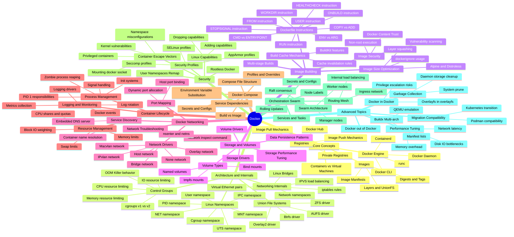

- **Docker**:
  - Core Concepts:
    - Containers vs Virtual Machines
    - Images:
      - Layers and UnionFS
      - Image Manifests
      - Digests and Tags
    - Registries:
      - Docker Hub
      - Private Registries
      - Image Pull Mechanics
      - Image Push Mechanics
    - Docker Engine:
      - Docker Daemon
      - Docker CLI
      - Containerd
      - runc
  - Architecture and Internals:
    - Linux Namespaces:
      - PID namespace
      - NET namespace
      - MNT namespace
      - UTS namespace
      - IPC namespace
      - User namespace
      - Cgroup namespace
    - Control Groups:
      - cgroups v1 vs v2
      - CPU resource limiting
      - Memory resource limiting
      - IO resource limiting
      - OOM Killer behavior
    - Union File Systems:
      - Overlay2 driver
      - AUFS driver
      - Btrfs driver
      - ZFS driver
    - Networking Internals:
      - Network namespaces
      - Virtual Ethernet pairs
      - Linux Bridges
      - iptables rules
      - IPVS load balancing
  - Image Building:
    - Dockerfile Instructions:
      - FROM instruction
      - RUN instruction
      - CMD vs ENTRYPOINT
      - COPY vs ADD
      - WORKDIR instruction
      - ENV vs ARG
      - USER instruction
      - HEALTHCHECK instruction
      - STOPSIGNAL instruction
      - ONBUILD instruction
    - Build Cache Mechanics:
      - Cache invalidation rules
      - BuildKit features
    - Multi-stage Builds
    - Image Size Optimization:
      - Alpine and Distroless
      - Layer squashing
      - dockerignore usage
    - Image Security:
      - Non-root execution
      - Vulnerability scanning
      - Docker Content Trust
  - Storage and Volumes:
    - Storage Drivers
    - Volume Types:
      - Named volumes
      - Bind mounts
      - tmpfs mounts
    - Volume Drivers
    - Data Persistence Patterns
    - Storage Performance Tuning
  - Docker Networking:
    - Network Drivers:
      - Bridge network
      - Host network
      - None network
      - Overlay network
      - Macvlan network
      - IPvlan network
    - Service Discovery:
      - Embedded DNS server
      - Container name resolution
    - Port Mapping:
      - Host port binding
      - Dynamic port allocation
    - Network Troubleshooting:
      - Network inspect command
      - nsenter and netns
  - Container Lifecycle:
    - Process Management:
      - PID 1 responsibilities
      - Signal handling
      - Zombie process reaping
      - Init systems
    - Resource Management:
      - CPU shares and quotas
      - Memory limits
      - Swap limits
      - Block IO weighting
    - Logging and Monitoring:
      - Logging drivers
      - Log rotation
      - Metrics collection
      - Docker events
  - Docker Compose:
    - Compose File Structure
    - Service Dependencies
    - Environment Variable Substitution
    - Secrets and Configs
    - Profiles and Overrides
    - Build vs Image
  - Security:
    - Container Escape Vectors:
      - Privileged containers
      - Mounting docker socket
      - Kernel vulnerabilities
      - Namespace misconfigurations
    - Security Profiles:
      - Seccomp profiles
      - AppArmor profiles
      - SELinux profiles
    - Linux Capabilities:
      - Dropping capabilities
      - Adding capabilities
    - Rootless Docker
    - User Namespaces Remap
  - Orchestration Swarm:
    - Swarm Architecture:
      - Manager nodes
      - Worker nodes
      - Raft consensus
    - Services and Tasks
    - Routing Mesh:
      - Ingress network
      - Internal load balancing
    - Secrets and Configs
    - Rolling Updates
    - Node Labels
  - Advanced Topics:
    - Docker in Docker:
      - Privilege escalation risks
      - Overlayfs in overlayfs
    - Docker out of Docker
    - Buildx Multi-arch:
      - QEMU emulation
      - Manifest lists
    - Performance Tuning:
      - Disk IO bottlenecks
      - Network latency
      - Memory overhead
    - Garbage Collection:
      - System prune
      - Daemon storage cleanup
    - Migration Compatibility:
      - Podman compatibility
      - Kubernetes transition
