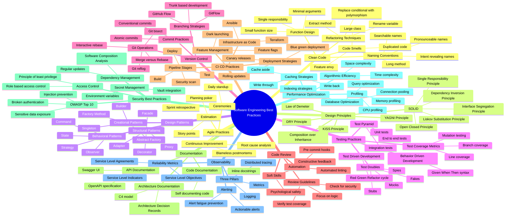

- **Software Engineering Best Practices**:
  - Clean Code:
    - Naming Conventions:
      - Intent revealing names
      - Pronounceable names
      - Searchable names
    - Function Design:
      - Single responsibility
      - Small function size
      - Minimal arguments
    - Code Smells:
      - Long method
      - Large class
      - Duplicated code
      - Feature envy
    - Refactoring Techniques:
      - Extract method
      - Rename variable
      - Replace conditional with polymorphism
  - Design Principles:
    - SOLID:
      - Single Responsibility Principle
      - Open Closed Principle
      - Liskov Substitution Principle
      - Interface Segregation Principle
      - Dependency Inversion Principle
    - DRY Principle
    - KISS Principle
    - YAGNI Principle
    - Composition over Inheritance
    - Law of Demeter
  - Design Patterns:
    - Creational Patterns:
      - Singleton
      - Factory Method
      - Abstract Factory
      - Builder
    - Structural Patterns:
      - Adapter
      - Decorator
      - Facade
      - Proxy
    - Behavioral Patterns:
      - Observer
      - Strategy
      - State
      - Command
  - Testing Practices:
    - Test Pyramid:
      - Unit tests
      - Integration tests
      - End to end tests
    - Test Doubles:
      - Mocks
      - Stubs
      - Fakes
      - Spies
    - Test Driven Development:
      - Red Green Refactor cycle
    - Behavior Driven Development:
      - Given When Then syntax
    - Test Coverage Metrics:
      - Line coverage
      - Branch coverage
      - Mutation testing
  - Version Control:
    - Branching Strategies:
      - Trunk based development
      - GitFlow
      - GitHub Flow
    - Git Operations:
      - Merge versus Rebase
      - Interactive rebase
      - Git bisect
      - Git reflog
    - Commit Practices:
      - Conventional commits
      - Atomic commits
  - Code Review:
    - Review Guidelines:
      - Focus on logic
      - Check for security
      - Verify test coverage
    - Soft Skills:
      - Constructive feedback
      - Psychological safety
    - Automation:
      - Pre commit hooks
      - Automated linting
  - CI CD Practices:
    - Pipeline Stages:
      - Build
      - Test
      - Security scan
      - Deploy
    - Deployment Strategies:
      - Blue green deployment
      - Canary releases
      - Rolling updates
    - Feature Management:
      - Feature flags
      - Dark launching
    - Infrastructure as Code:
      - Terraform
      - Ansible
  - Documentation:
    - Code Documentation:
      - Self documenting code
      - Inline docstrings
    - Architecture Documentation:
      - C4 model
      - Architecture Decision Records
    - API Documentation:
      - OpenAPI specification
      - Swagger UI
  - Security Best Practices:
    - OWASP Top 10:
      - Injection prevention
      - Broken authentication
      - Sensitive data exposure
    - Access Control:
      - Principle of least privilege
      - Role based access control
    - Secret Management:
      - Environment variables
      - Vault integration
    - Dependency Management:
      - Software Composition Analysis
      - Regular updates
  - Performance Optimization:
    - Algorithmic Efficiency:
      - Time complexity
      - Space complexity
    - Database Optimization:
      - Indexing strategies
      - Query optimization
      - Connection pooling
    - Caching Strategies:
      - Cache aside
      - Write through
      - Write back
    - Profiling:
      - CPU profiling
      - Memory profiling
  - Observability:
    - Three Pillars:
      - Logging
      - Metrics
      - Distributed tracing
    - Reliability Metrics:
      - Service Level Indicators
      - Service Level Objectives
      - Service Level Agreements
    - Alerting:
      - Alert fatigue prevention
      - Actionable alerts
  - Agile Practices:
    - Estimation:
      - Story points
      - Planning poker
    - Ceremonies:
      - Daily standup
      - Sprint retrospective
    - Continuous Improvement:
      - Blameless postmortems
      - Root cause analysis

