- **AWS Cloud**:
  - Core Concepts:
    - Regions and Availability Zones
    - Edge Locations and Points of Presence
    - IAM:
      - Users, Groups, Roles
      - Policies (Identity vs Resource-based)
      - Policy Evaluation Logic
      - STS (Security Token Service)
      - AssumeRole and Cross-Account Access
      - IAM Conditions and Keys
      - Permission Boundaries
      - Service Control Policies (SCPs)
    - Billing and Cost Management:
      - Pricing Models and Savings Plans
      - Cost Explorer
      - AWS Budgets
      - Cost Allocation Tags
      - AWS Organizations and Consolidated Billing
  - Compute:
    - EC2:
      - Instance Types
      - Instance Lifecycle
      - EBS:
        - Volume Types
        - Snapshots and AMIs
        - Encryption (KMS integration)
        - Multi-Attach
      - Instance Store vs EBS
      - Placement Groups
      - Auto Scaling Groups:
        - Scaling Policies
        - Lifecycle Hooks
        - Launch Templates vs Configurations
        - Warm Pools
      - Elastic Load Balancing:
        - Application Load Balancer (ALB)
        - Network Load Balancer (NLB)
        - Gateway Load Balancer (GWLB)
        - Target Groups and Health Checks
        - Connection Draining and Idle Timeout
      - EC2 Networking:
        - Elastic Network Interface (ENI)
        - Elastic Fabric Adapter (EFA)
    - Serverless Compute:
      - AWS Lambda:
        - Execution Environments and Runtimes
        - Cold Starts and Provisioned Concurrency
        - Event Sources (Sync vs Async)
        - Destination Configurations and DLQs
        - Lambda Layers and Extensions
        - Concurrency Limits and Throttling
        - VPC Networking for Lambda
        - Lambda File System (EFS)
      - AWS Fargate:
        - Task Definitions and Services
        - Networking Modes (awsvpc)
        - Fargate Spot
  - Storage:
    - S3:
      - Storage Classes
      - Object Lifecycle Management
      - S3 Consistency Model
      - S3 Security:
        - Bucket Policies vs IAM Policies
        - Block Public Access
        - S3 Access Points
        - Presigned URLs
      - S3 Features:
        - Versioning and MFA Delete
        - Replication (CRR, SRR, Batch)
        - Event Notifications
        - S3 Select and Glacier Select
        - Object Lock and WORM
        - Transfer Acceleration
    - EFS:
      - Performance Modes
      - Throughput Modes
      - Storage Classes
    - FSx:
      - FSx for Windows File Server
      - FSx for Lustre
      - FSx for NetApp ONTAP
      - FSx for OpenZFS
    - Storage Gateway:
      - File Gateway
      - Volume Gateway (Cached vs Stored)
      - Tape Gateway
  - Databases:
    - RDS:
      - Supported Engines
      - Multi-AZ Deployments
      - Read Replicas
      - Automated Backups and Snapshots
      - Maintenance Windows and Patching
    - Amazon Aurora:
      - Aurora Storage Architecture
      - Aurora Serverless v1 and v2
      - Aurora Global Databases
      - Aurora Machine Learning
      - Fast Cloning and Backtrack
    - DynamoDB:
      - Data Model
      - Primary Keys
      - Capacity Modes
      - Indexes (LSI, GSI)
      - DynamoDB Streams and Triggers
      - Transactions (ACID)
      - DAX (DynamoDB Accelerator)
      - Global Tables
      - Time to Live (TTL)
      - Point-in-Time Recovery (PITR)
    - ElastiCache:
      - Redis
      - Memcached
      - Cache Eviction Policies
    - Neptune
    - DocumentDB
    - Redshift:
      - Cluster Architecture
      - Distribution Styles
      - Sort Keys and Zone Maps
      - Redshift Spectrum
      - Concurrency Scaling
  - Networking and Content Delivery:
    - VPC:
      - Subnets
      - Route Tables and Routing Logic
      - Internet Gateway (IGW)
      - NAT Gateway vs NAT Instance
      - VPC Endpoints:
        - Interface Endpoints (PrivateLink)
        - Gateway Endpoints
      - VPC Peering
      - Transit Gateway:
        - Route Tables and Attachments
        - Share via RAM
      - Security Groups vs Network ACLs
      - VPC Flow Logs
      - Egress-Only Internet Gateway
    - Route 53:
      - Hosted Zones
      - Routing Policies:
        - Simple
        - Weighted
        - Latency-based
        - Failover
        - Geolocation
        - Geoproximity
        - Multivalue Answer
      - Health Checks
      - DNSSEC
    - CloudFront:
      - Distributions
      - Cache Behaviors and TTLs
      - Origin Types
      - Signed URLs and Signed Cookies
      - Lambda@Edge and CloudFront Functions
      - Field-Level Encryption
    - AWS Direct Connect:
      - Dedicated vs Hosted Connections
      - Virtual Interfaces
      - Link Aggregation Group (LAG)
      - MACsec
    - AWS VPN:
      - Site-to-Site VPN
      - Client VPN
  - Security, Identity, and Compliance:
    - KMS:
      - Symmetric vs Asymmetric Keys
      - CMK vs AWS Managed Keys
      - Key Policies vs Grants
      - Envelope Encryption
      - Multi-Region Keys
    - Secrets Manager:
      - Automatic Rotation
      - Integration with RDS
    - WAF:
      - Web ACLs and Rules
      - Managed Rule Groups
      - Rate-based Rules
    - Shield:
      - Standard vs Advanced
      - DDoS Response Team (DRT)
    - GuardDuty:
      - Threat Intelligence Feeds
      - Finding Types
    - Inspector:
      - Network and Host Assessments
    - Macie:
      - Sensitive Data Discovery
    - CloudTrail:
      - Management Events vs Data Events
      - Log File Validation
      - Organization Trails
    - Config:
      - Configuration Items and History
      - Conformance Packs
      - Remediation Actions
  - Application Integration and Messaging:
    - SQS:
      - Standard vs FIFO Queues
      - Visibility Timeout
      - Dead-Letter Queues (DLQ)
      - Long Polling vs Short Polling
      - Message Deduplication and Group IDs
    - SNS:
      - Topics
      - Fanout Architecture
      - Message Filtering
      - Delivery Status Logging
    - EventBridge:
      - Event Buses
      - Event Patterns and Rules
      - Schema Registry
    - Step Functions:
      - Standard vs Express Workflows
      - Amazon States Language (ASL)
      - Error Handling and Retries
      - Distributed Map State
    - API Gateway:
      - REST vs HTTP vs WebSocket APIs
      - Stages and Deployments
      - Authorizers
      - Usage Plans and API Keys
      - Integration Types
      - Caching and Throttling
  - DevOps and Management Tools:
    - CloudFormation:
      - Templates and Stacks
      - Intrinsic Functions
      - Change Sets
      - StackSets
      - Drift Detection
      - Custom Resources
    - CDK:
      - Constructs (L1, L2, L3)
      - Stacks and Apps
      - Synthesis and Deployment
    - Elastic Beanstalk:
      - Deployment Policies
      - Environment Tiers
    - Systems Manager (SSM):
      - Parameter Store
      - Run Command
      - State Manager
      - Session Manager
      - Patch Manager
    - CloudWatch:
      - Metrics
      - Logs and Log Groups
      - Alarms and Actions
      - Event Rules
      - Synthetics (Canaries)
      - Contributor Insights
    - X-Ray:
      - Tracing and Segments
      - Service Map
      - Sampling Rules
  - Advanced Architecture and Design Patterns:
    - High Availability and Fault Tolerance:
      - Multi-AZ Design
      - Active-Active vs Active-Passive
      - Chaos Engineering (FIS)
    - Disaster Recovery Strategies:
      - Backup and Restore
      - Pilot Light
      - Warm Standby
      - Multi-Site Active/Active
      - RTO and RPO Optimization
    - Scalability Patterns:
      - Horizontal vs Vertical Scaling
      - Caching Strategies
    - Microservices on AWS:
      - Service Mesh (App Mesh)
      - Container Orchestration (ECS, EKS)
      - EKS Architecture
      - EKS Networking (VPC CNI)
  - Migration and Hybrid Cloud:
    - Migration Strategies (6 Rs)
    - Application Discovery Service
    - Database Migration Service (DMS):
      - Homogeneous vs Heterogeneous Migrations
      - Schema Conversion Tool (SCT)
      - Continuous Data Replication (CDC)
    - Snow Family:
      - Snowcone, Snowball Edge, Snowmobile
      - Data Transfer and Edge Computing
    - DataSync:
      - Online Data Transfer
    - Storage Gateway:
      - Hybrid Storage
  - Machine Learning and AI:
    - SageMaker:
      - Built-in Algorithms
      - Training Jobs and Hyperparameter Tuning
      - Endpoint Deployment and Auto Scaling
      - SageMaker Pipelines
      - Feature Store
    - AI Services Suite
    - Bedrock:
      - Foundation Models
      - Prompt Engineering
      - Knowledge Bases and Agents
  - Well-Architected Framework:
    - Operational Excellence
    - Security
    - Reliability
    - Performance Efficiency
    - Cost Optimization
    - Sustainability

```mermaid
mindmap
  ((AWS Cloud))
    Core Concepts
      Regions and AZs
      Edge Locations and PoPs
      IAM
        Users Groups Roles
        Identity vs Resource Policies
        Policy Evaluation Logic
        STS Security Token Service
        AssumeRole Cross-Account Access
        IAM Conditions and Keys
        Permission Boundaries
        Service Control Policies SCPs
      Billing and Cost Management
        Pricing Models and Savings Plans
        Cost Explorer
        AWS Budgets
        Cost Allocation Tags
        Organizations Consolidated Billing
    Compute
      EC2
        Instance Types
        Instance Lifecycle
        EBS
          Volume Types
          Snapshots and AMIs
          Encryption KMS Integration
          Multi-Attach
        Instance Store vs EBS
        Placement Groups
        Auto Scaling Groups
          Scaling Policies
          Lifecycle Hooks
          Launch Templates vs Configurations
          Warm Pools
        Elastic Load Balancing
          Application Load Balancer ALB
          Network Load Balancer NLB
          Gateway Load Balancer GWLB
          Target Groups Health Checks
          Connection Draining Idle Timeout
        EC2 Networking
          Elastic Network Interface ENI
          Elastic Fabric Adapter EFA
      Serverless Compute
        AWS Lambda
          Execution Environments Runtimes
          Cold Starts Provisioned Concurrency
          Event Sources Sync Async
          Destination Configurations DLQs
          Lambda Layers Extensions
          Concurrency Limits Throttling
          VPC Networking for Lambda
          Lambda File System EFS
        AWS Fargate
          Task Definitions Services
          Networking Modes awsvpc
          Fargate Spot
    Storage
      S3
        Storage Classes
        Object Lifecycle Management
        S3 Consistency Model
        S3 Security
          Bucket vs IAM Policies
          Block Public Access
          S3 Access Points
          Presigned URLs
        S3 Features
          Versioning MFA Delete
          Replication CRR SRR Batch
          Event Notifications
          S3 Select Glacier Select
          Object Lock WORM
          Transfer Acceleration
      EFS
        Performance Modes
        Throughput Modes
        Storage Classes
      FSx
        FSx Windows File Server
        FSx Lustre
        FSx NetApp ONTAP
        FSx OpenZFS
      Storage Gateway
        File Gateway
        Volume Gateway Cached Stored
        Tape Gateway
    Databases
      RDS
        Supported Engines
        Multi-AZ Deployments
        Read Replicas
        Automated Backups Snapshots
        Maintenance Windows Patching
      Amazon Aurora
        Aurora Storage Architecture
        Aurora Serverless v1 v2
        Aurora Global Databases
        Aurora Machine Learning
        Fast Cloning Backtrack
      DynamoDB
        Data Model
        Primary Keys
        Capacity Modes
        Indexes LSI GSI
        DynamoDB Streams Triggers
        Transactions ACID
        DAX DynamoDB Accelerator
        Global Tables
        Time to Live TTL
        Point-in-Time Recovery PITR
      ElastiCache
        Redis
        Memcached
        Cache Eviction Policies
      Neptune
      DocumentDB
      Redshift
        Cluster Architecture
        Distribution Styles
        Sort Keys Zone Maps
        Redshift Spectrum
        Concurrency Scaling
    Networking and Content Delivery
      VPC
        Subnets
        Route Tables Routing Logic
        Internet Gateway IGW
        NAT Gateway vs Instance
        VPC Endpoints
          Interface Endpoints PrivateLink
          Gateway Endpoints
        VPC Peering
        Transit Gateway
          Route Tables Attachments
          Share via RAM
        Security Groups vs NACLs
        VPC Flow Logs
        Egress-Only Internet Gateway
      Route 53
        Hosted Zones
        Routing Policies
          Simple
          Weighted
          Latency-based
          Failover
          Geolocation
          Geoproximity
          Multivalue Answer
        Health Checks
        DNSSEC
      CloudFront
        Distributions
        Cache Behaviors TTLs
        Origin Types
        Signed URLs Cookies
        Lambda@Edge CloudFront Functions
        Field-Level Encryption
      AWS Direct Connect
        Dedicated vs Hosted Connections
        Virtual Interfaces
        Link Aggregation Group LAG
        MACsec
      AWS VPN
        Site-to-Site VPN
        Client VPN
    Security Identity Compliance
      KMS
        Symmetric vs Asymmetric Keys
        CMK vs AWS Managed Keys
        Key Policies vs Grants
        Envelope Encryption
        Multi-Region Keys
      Secrets Manager
        Automatic Rotation
        Integration with RDS
      WAF
        Web ACLs Rules
        Managed Rule Groups
        Rate-based Rules
      Shield
        Standard vs Advanced
        DDoS Response Team DRT
      GuardDuty
        Threat Intelligence Feeds
        Finding Types
      Inspector
        Network and Host Assessments
      Macie
        Sensitive Data Discovery
      CloudTrail
        Management vs Data Events
        Log File Validation
        Organization Trails
      Config
        Configuration Items History
        Conformance Packs
        Remediation Actions
    Application Integration Messaging
      SQS
        Standard vs FIFO Queues
        Visibility Timeout
        Dead-Letter Queues DLQ
        Long vs Short Polling
        Message Deduplication Group IDs
      SNS
        Topics
        Fanout Architecture
        Message Filtering
        Delivery Status Logging
      EventBridge
        Event Buses
        Event Patterns Rules
        Schema Registry
      Step Functions
        Standard vs Express Workflows
        Amazon States Language ASL
        Error Handling Retries
        Distributed Map State
      API Gateway
        REST HTTP WebSocket APIs
        Stages and Deployments
        Authorizers
        Usage Plans API Keys
        Integration Types
        Caching and Throttling
    DevOps Management Tools
      CloudFormation
        Templates and Stacks
        Intrinsic Functions
        Change Sets
        StackSets
        Drift Detection
        Custom Resources
      CDK
        Constructs L1 L2 L3
        Stacks and Apps
        Synthesis and Deployment
      Elastic Beanstalk
        Deployment Policies
        Environment Tiers
      Systems Manager SSM
        Parameter Store
        Run Command
        State Manager
        Session Manager
        Patch Manager
      CloudWatch
        Metrics
        Logs and Log Groups
        Alarms and Actions
        Event Rules
        Synthetics Canaries
        Contributor Insights
      X-Ray
        Tracing and Segments
        Service Map
        Sampling Rules
    Advanced Architecture Patterns
      High Availability Fault Tolerance
        Multi-AZ Design
        Active-Active vs Active-Passive
        Chaos Engineering FIS
      Disaster Recovery Strategies
        Backup and Restore
        Pilot Light
        Warm Standby
        Multi-Site Active/Active
        RTO and RPO Optimization
      Scalability Patterns
        Horizontal vs Vertical Scaling
        Caching Strategies
      Microservices on AWS
        Service Mesh App Mesh
        Container Orchestration ECS EKS
        EKS Architecture
        EKS Networking VPC CNI
    Migration and Hybrid Cloud
      Migration Strategies 6 Rs
      Application Discovery Service
      Database Migration Service DMS
        Homogeneous vs Heterogeneous Migrations
        Schema Conversion Tool SCT
        Continuous Data Replication CDC
      Snow Family
        Snowcone Snowball Edge Snowmobile
        Data Transfer Edge Computing
      DataSync
        Online Data Transfer
      Storage Gateway
        Hybrid Storage
    Machine Learning and AI
      SageMaker
        Built-in Algorithms
        Training Jobs Hyperparameter Tuning
        Endpoint Deployment Auto Scaling
        SageMaker Pipelines
        Feature Store
      AI Services Suite
      Bedrock
        Foundation Models
        Prompt Engineering
        Knowledge Bases Agents
    Well-Architected Framework
      Operational Excellence
      Security
      Reliability
      Performance Efficiency
      Cost Optimization
      Sustainability
```
