- **CI/CD**:
  - Core Concepts:
    - Continuous Integration:
      - Definition and goals
      - Code commit triggers
      - Automated testing integration
      - Build artifact generation
    - Continuous Delivery:
      - Definition and goals
      - Manual approval gates
      - Environment parity
      - Release readiness
    - Continuous Deployment:
      - Definition and goals
      - Zero-touch production releases
      - Automated rollback mechanisms
    - DevOps Culture:
      - Shared responsibility
      - Blameless postmortems
      - Shift-left testing
  - Version Control Systems:
    - Git Fundamentals:
      - Branching strategies:
        - GitFlow
        - GitHub Flow
        - GitLab Flow
        - Trunk-based development
      - Merge vs Rebase
      - Pull Request workflows
      - Commit message conventions
    - Advanced VCS:
      - Git hooks
      - Submodules and subtrees
      - Monorepo vs Polyrepo:
        - Build caching strategies
        - Dependency management
        - Code ownership
  - Build Systems and Tools:
    - Build Automation:
      - Make and CMake
      - Gradle and Maven
      - Webpack and Vite
      - Docker build optimization:
        - Multi-stage builds
        - Layer caching
        - BuildKit features
    - Dependency Management:
      - Lock files
      - Vulnerability scanning
      - Software Bill of Materials
      - Internal artifact registries
  - Automated Testing in CI:
    - Testing Pyramid:
      - Unit testing
      - Integration testing
      - End-to-end testing
    - Test Execution Strategies:
      - Parallel test execution
      - Test sharding
      - Flaky test detection
      - Test impact analysis
    - Static Analysis:
      - Linting and formatting
      - Static Application Security Testing
      - Code quality metrics
  - Pipeline Architecture:
    - Pipeline as Code:
      - Jenkinsfile syntax
      - GitHub Actions YAML
      - GitLab CI YAML
      - Argo Workflows
    - Pipeline Design Patterns:
      - Sequential vs Parallel stages
      - Fan-out and Fan-in
      - Matrix builds
      - Pipeline templating
    - State Management:
      - Pipeline variables and secrets
      - Workspace and artifact passing
      - Dependency and build caching
  - Deployment Strategies:
    - Basic Strategies:
      - Recreate deployment
      - Rolling updates
    - Advanced Strategies:
      - Blue-Green deployment:
        - Traffic switching mechanisms
        - Database migration handling
      - Canary releases:
        - Progressive traffic shifting
        - Automated metric evaluation
      - Feature flags:
        - Decoupling deploy from release
        - Targeted user rollouts
        - Kill switches
      - A/B testing integration
  - Infrastructure as Code:
    - Provisioning Tools:
      - Terraform state management
      - CloudFormation
      - Pulumi
    - Configuration Management:
      - Ansible
      - Chef and Puppet
    - Kubernetes Deployment:
      - Helm charts
      - Kustomize
      - GitOps principles:
        - Single source of truth
        - Reconciliation loops
        - Drift detection
        - Pull-based vs Push-based
  - Security in CI/CD:
    - Secret Management:
      - HashiCorp Vault
      - Cloud provider secret managers
      - Platform native secrets
      - OpenID Connect authentication
    - Supply Chain Security:
      - Artifact signing
      - Build provenance verification
      - SLSA framework levels
      - In-toto attestations
    - Container Security:
      - Image vulnerability scanning
      - Base image minimization
      - Runtime security policies
    - Compliance and Auditing:
      - Pipeline execution logs
      - Immutable audit trails
      - Regulatory compliance checks
  - Observability and Monitoring:
    - Deployment Metrics:
      - Deployment frequency
      - Lead time for changes
      - Change failure rate
      - Mean time to recovery
    - Post-Deployment Monitoring:
      - Application Performance Monitoring
      - Log aggregation
      - Distributed tracing
      - Automated alerting
  - Advanced CI/CD Patterns:
    - Ephemeral Environments:
      - Preview environments per PR
      - Dynamic resource provisioning
      - Teardown automation
    - Multi-Cloud Deployments:
      - Cross-cloud artifact replication
      - Environment-specific configurations
    - Database Migrations:
      - Zero-downtime migrations
      - Backward compatible schema changes
      - Expand and contract pattern
      - Migration rollback strategies
    - Disaster Recovery:
      - Pipeline failover mechanisms
      - Infrastructure recreation
  - Tooling Ecosystem:
    - Runner Architecture:
      - Self-hosted vs SaaS runners
      - Security isolation mechanisms
      - Autoscaling runner fleets
      - Custom runner images
    - Platform Specifics:
      - Jenkins master-agent architecture
      - GitHub Actions composite actions
      - GitLab CI needs and rules
      - CircleCI Orbs and caching

```mermaid
mindmap
  ((CI/CD))
    Core Concepts
      Continuous Integration
        Definition and goals
        Code commit triggers
        Automated testing integration
        Build artifact generation
      Continuous Delivery
        Definition and goals
        Manual approval gates
        Environment parity
        Release readiness
      Continuous Deployment
        Definition and goals
        Zero-touch production releases
        Automated rollback mechanisms
      DevOps Culture
        Shared responsibility
        Blameless postmortems
        Shift-left testing
    Version Control Systems
      Git Fundamentals
        Branching strategies
          GitFlow
          GitHub Flow
          GitLab Flow
          Trunk-based development
        Merge vs Rebase
        Pull Request workflows
        Commit message conventions
      Advanced VCS
        Git hooks
        Submodules and subtrees
        Monorepo vs Polyrepo
          Build caching strategies
          Dependency management
          Code ownership
    Build Systems and Tools
      Build Automation
        Make and CMake
        Gradle and Maven
        Webpack and Vite
        Docker build optimization
          Multi-stage builds
          Layer caching
          BuildKit features
      Dependency Management
        Lock files
        Vulnerability scanning
        Software Bill of Materials
        Internal artifact registries
    Automated Testing in CI
      Testing Pyramid
        Unit testing
        Integration testing
        End-to-end testing
      Test Execution Strategies
        Parallel test execution
        Test sharding
        Flaky test detection
        Test impact analysis
      Static Analysis
        Linting and formatting
        Static Application Security Testing
        Code quality metrics
    Pipeline Architecture
      Pipeline as Code
        Jenkinsfile syntax
        GitHub Actions YAML
        GitLab CI YAML
        Argo Workflows
      Pipeline Design Patterns
        Sequential vs Parallel stages
        Fan-out and Fan-in
        Matrix builds
        Pipeline templating
      State Management
        Pipeline variables and secrets
        Workspace and artifact passing
        Dependency and build caching
    Deployment Strategies
      Basic Strategies
        Recreate deployment
        Rolling updates
      Advanced Strategies
        Blue-Green deployment
          Traffic switching mechanisms
          Database migration handling
        Canary releases
          Progressive traffic shifting
          Automated metric evaluation
        Feature flags
          Decoupling deploy from release
          Targeted user rollouts
          Kill switches
        A/B testing integration
    Infrastructure as Code
      Provisioning Tools
        Terraform state management
        CloudFormation
        Pulumi
      Configuration Management
        Ansible
        Chef and Puppet
      Kubernetes Deployment
        Helm charts
        Kustomize
        GitOps principles
          Single source of truth
          Reconciliation loops
          Drift detection
          Pull-based vs Push-based
    Security in CI/CD
      Secret Management
        HashiCorp Vault
        Cloud provider secret managers
        Platform native secrets
        OpenID Connect authentication
      Supply Chain Security
        Artifact signing
        Build provenance verification
        SLSA framework levels
        In-toto attestations
      Container Security
        Image vulnerability scanning
        Base image minimization
        Runtime security policies
      Compliance and Auditing
        Pipeline execution logs
        Immutable audit trails
        Regulatory compliance checks
    Observability and Monitoring
      Deployment Metrics
        Deployment frequency
        Lead time for changes
        Change failure rate
        Mean time to recovery
      Post-Deployment Monitoring
        Application Performance Monitoring
        Log aggregation
        Distributed tracing
        Automated alerting
    Advanced CI/CD Patterns
      Ephemeral Environments
        Preview environments per PR
        Dynamic resource provisioning
        Teardown automation
      Multi-Cloud Deployments
        Cross-cloud artifact replication
        Environment-specific configurations
      Database Migrations
        Zero-downtime migrations
        Backward compatible schema changes
        Expand and contract pattern
        Migration rollback strategies
      Disaster Recovery
        Pipeline failover mechanisms
        Infrastructure recreation
    Tooling Ecosystem
      Runner Architecture
        Self-hosted vs SaaS runners
        Security isolation mechanisms
        Autoscaling runner fleets
        Custom runner images
      Platform Specifics
        Jenkins master-agent architecture
        GitHub Actions composite actions
        GitLab CI needs and rules
        CircleCI Orbs and caching
```
