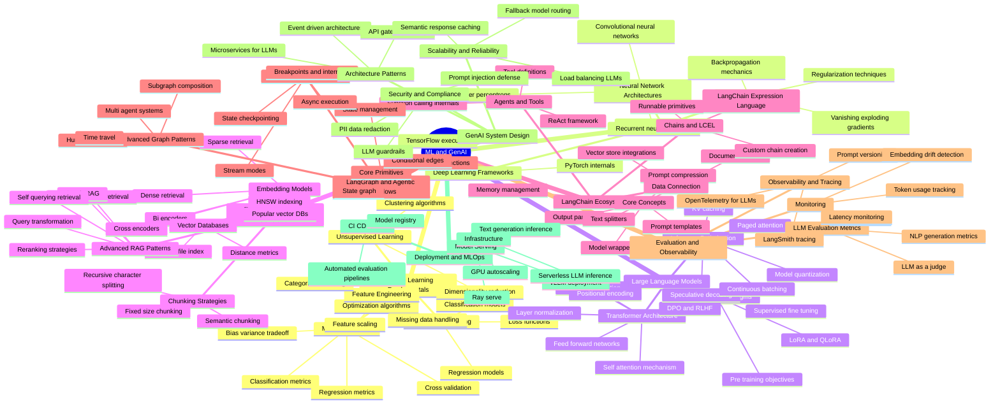

- **ML and GenAI**:
  - Machine Learning Fundamentals:
    - Supervised Learning:
      - Regression models
      - Classification models
      - Loss functions
      - Optimization algorithms
    - Unsupervised Learning:
      - Clustering algorithms
      - Dimensionality reduction
    - Model Evaluation:
      - Classification metrics
      - Regression metrics
      - Cross validation
      - Bias variance tradeoff
    - Feature Engineering:
      - Feature scaling
      - Categorical encoding
      - Missing data handling
  - Deep Learning Foundations:
    - Neural Network Architectures:
      - Multi layer perceptrons
      - Convolutional neural networks
      - Recurrent neural networks
    - Training Dynamics:
      - Backpropagation mechanics
      - Vanishing exploding gradients
      - Regularization techniques
    - Deep Learning Frameworks:
      - PyTorch internals
      - TensorFlow execution
  - Large Language Models:
    - Transformer Architecture:
      - Self attention mechanism
      - Multi head attention
      - Positional encoding
      - Feed forward networks
      - Layer normalization
    - LLM Training Paradigms:
      - Pre training objectives
      - Supervised fine tuning
      - LoRA and QLoRA
      - DPO and RLHF
    - Inference Optimization:
      - KV caching
      - Paged attention
      - Model quantization
      - Speculative decoding
      - Continuous batching
  - Retrieval Augmented Generation:
    - Embedding Models:
      - Dense retrieval
      - Sparse retrieval
      - Bi encoders
      - Cross encoders
    - Vector Databases:
      - HNSW indexing
      - Inverted file index
      - Distance metrics
      - Popular vector DBs
    - Chunking Strategies:
      - Fixed size chunking
      - Semantic chunking
      - Recursive character splitting
    - Advanced RAG Patterns:
      - Query transformation
      - Reranking strategies
      - Parent document retrieval
      - Graph RAG
      - Self querying retrieval
  - LangChain Ecosystem:
    - Core Concepts:
      - Prompt templates
      - Prompt compression
      - Model wrappers
      - Output parsers
      - Memory management
    - Data Connection:
      - Document loaders
      - Text splitters
      - Vector store integrations
    - Chains and LCEL:
      - LangChain Expression Language
      - Runnable primitives
      - Custom chain creation
    - Agents and Tools:
      - ReAct framework
      - Tool definitions
      - Function calling internals
  - LangGraph and Agentic Workflows:
    - Core Primitives:
      - State graph
      - Node functions
      - Conditional edges
      - State management
    - Advanced Graph Patterns:
      - Multi agent systems
      - Human in the loop
      - Time travel
      - Subgraph composition
    - Streaming and Execution:
      - Stream modes
      - Async execution
      - State checkpointing
      - Breakpoints and interrupts
  - Evaluation and Observability:
    - LLM Evaluation Metrics:
      - NLP generation metrics
      - LLM as a judge
      - RAGAS metrics
    - Observability and Tracing:
      - LangSmith tracing
      - OpenTelemetry for LLMs
      - Prompt versioning
    - Monitoring:
      - Token usage tracking
      - Latency monitoring
      - Embedding drift detection
  - GenAI System Design:
    - Architecture Patterns:
      - Microservices for LLMs
      - Event driven architectures
      - API gateway routing
    - Scalability and Reliability:
      - Load balancing LLMs
      - Fallback model routing
      - Semantic response caching
    - Security and Compliance:
      - Prompt injection defense
      - PII data redaction
      - LLM guardrails
  - Deployment and MLOps:
    - Model Serving:
      - vLLM deployment
      - Text generation inference
      - Ray serve
    - CI CD for ML:
      - Model registry
      - Automated evaluation pipelines
    - Infrastructure:
      - GPU autoscaling
      - Serverless LLM inference
