- **REST API Microservices Frameworks**:
  - REST API Fundamentals:
    - Core Principles:
      - Client-Server Architecture
      - Statelessness
      - Cacheability
      - Uniform Interface:
        - Resource Identification
        - Resource Manipulation
        - Self-descriptive Messages
        - HATEOAS
    - HTTP Protocol Deep Dive:
      - HTTP Methods:
        - GET
        - POST
        - PUT
        - PATCH
        - DELETE
        - OPTIONS
        - HEAD
      - HTTP Status Codes:
        - 1xx Informational
        - 2xx Success
        - 3xx Redirection
        - 4xx Client Error
        - 5xx Server Error
      - HTTP Headers:
        - Content-Type
        - Accept
        - Authorization
        - Cache-Control
        - CORS Headers
      - Content Negotiation
    - API Design Best Practices:
      - Resource Naming Conventions
      - Versioning Strategies:
        - URI Versioning
        - Header Versioning
        - Query Parameter Versioning
      - Pagination:
        - Offset-based Pagination
        - Cursor-based Pagination
        - Keyset Pagination
      - Filtering Sorting Searching
      - Rate Limiting
      - Idempotency
      - Error Handling Standards:
        - RFC 7807 Problem Details
    - Security in REST:
      - Authentication:
        - Basic Auth
        - Token-based JWT
        - OAuth2
        - OpenID Connect
      - Authorization:
        - Role-Based Access Control
        - Attribute-Based Access Control
      - Common Vulnerabilities:
        - Injection Attacks
        - Broken Object Level Authorization
        - Mass Assignment
        - Insecure Deserialization
  - Microservices Architecture:
    - Core Concepts:
      - Service Decomposition:
        - Domain-Driven Design
        - Bounded Contexts
        - Strangler Fig Pattern
      - Inter-service Communication:
        - Synchronous REST
        - Asynchronous Message Brokers
      - Data Management:
        - Database per Service
        - Saga Pattern
        - CQRS Pattern
        - Event Sourcing
        - Distributed Transactions
      - Service Discovery:
        - Client-side Discovery
        - Server-side Discovery
        - Service Registry
      - API Gateway:
        - Request Routing
        - Response Aggregation
        - Auth Offloading
        - Rate Limiting
        - Circuit Breaker
    - Observability:
      - Distributed Tracing:
        - OpenTelemetry
        - Correlation IDs
      - Centralized Logging:
        - ELK Stack
        - Fluentd
      - Metrics Monitoring:
        - Prometheus
        - Grafana
        - RED Method
    - Deployment Infrastructure:
      - Docker Containerization
      - Kubernetes Orchestration
      - CI CD Pipelines
      - Blue-Green Deployment
      - Canary Releases
    - Advanced Patterns:
      - Bulkhead Pattern
      - Exponential Backoff
      - Backpressure
      - Sidecar Pattern
  - Flask Framework:
    - Core Architecture:
      - WSGI Specification
      - Application Context
      - Request Context
      - Routing Mechanisms
      - View Functions
      - Class-Based Views
    - Request Response Handling:
      - Request Object
      - Response Object
      - JSON Serialization
      - File Uploads
    - Extensions Ecosystem:
      - Flask-SQLAlchemy ORM
      - Flask-Migrate Alembic
      - Flask-RESTful
      - Flask-JWT-Extended
      - Flask-Caching
    - Advanced Flask:
      - Blueprint Modularization
      - Application Factory Pattern
      - Custom Decorators
      - Error Handling
      - Blinker Signals
      - Pytest Integration
      - Async View Support
  - FastAPI Framework:
    - Core Architecture:
      - ASGI Specification
      - Starlette Foundation
      - Pydantic Integration
    - Dependency Injection:
      - Depends Function
      - Sub-dependencies
      - Yield Dependencies
      - Dependency Overrides
    - Data Validation:
      - Pydantic Models
      - Field Validators
      - Model Validators
      - Custom Types
    - Routing Operations:
      - Path Parameters
      - Query Parameters
      - Request Body
      - Response Models
      - Status Codes
      - Form Data
    - Advanced FastAPI:
      - Background Tasks
      - Middleware
      - CORS Middleware
      - WebSockets
      - OAuth2 Password Flow
      - JWT Token Generation
      - TestClient Usage
      - Async Database Integration
  - Django REST Framework:
    - Core Django Concepts:
      - MVT Architecture
      - ORM Fundamentals:
        - QuerySets
        - Select Related
        - Prefetch Related
        - F and Q Objects
        - Database Transactions
      - Middleware
      - Signals
    - DRF Serializers:
      - ModelSerializer
      - Field Validation
      - Nested Serializers
      - Dynamic Fields
    - DRF Views:
      - APIView
      - Generic Views
      - ViewSets
      - Routers
    - Authentication Permissions:
      - TokenAuthentication
      - SessionAuthentication
      - Custom Permission Classes
      - Object-level Permissions
    - Throttling Pagination:
      - Rate Limiting
      - DjangoFilterBackend
      - CursorPagination
    - Advanced Django:
      - Custom Management Commands
      - Celery Integration
      - Django Channels ASGI
      - Database Indexing
      - Redis Caching
      - N plus 1 Query
      - pytest-django Usage
  - System Design Tradeoffs:
    - Monolith vs Microservices
    - REST vs GraphQL
    - REST vs gRPC
    - Sync vs Async Communication
    - CAP Theorem
    - Scaling Strategies:
      - Horizontal Scaling
      - Vertical Scaling
      - Database Sharding
      - Read Replicas
    - API Gateway vs Service Mesh

```mermaid
mindmap
  ((REST API Microservices Frameworks))
    REST API Fundamentals
      Core Principles
        Client-Server Architecture
        Statelessness
        Cacheability
        Uniform Interface
          Resource Identification
          Resource Manipulation
          Self-descriptive Messages
          HATEOAS
      HTTP Protocol Deep Dive
        HTTP Methods
          GET
          POST
          PUT
          PATCH
          DELETE
          OPTIONS
          HEAD
        HTTP Status Codes
          1xx Informational
          2xx Success
          3xx Redirection
          4xx Client Error
          5xx Server Error
        HTTP Headers
          Content-Type
          Accept
          Authorization
          Cache-Control
          CORS Headers
        Content Negotiation
      API Design Best Practices
        Resource Naming Conventions
        Versioning Strategies
          URI Versioning
          Header Versioning
          Query Parameter Versioning
        Pagination
          Offset-based Pagination
          Cursor-based Pagination
          Keyset Pagination
        Filtering Sorting Searching
        Rate Limiting
        Idempotency
        Error Handling Standards
          RFC 7807 Problem Details
      Security in REST
        Authentication
          Basic Auth
          Token-based JWT
          OAuth2
          OpenID Connect
        Authorization
          Role-Based Access Control
          Attribute-Based Access Control
        Common Vulnerabilities
          Injection Attacks
          Broken Object Level Authorization
          Mass Assignment
          Insecure Deserialization
    Microservices Architecture
      Core Concepts
        Service Decomposition
          Domain-Driven Design
          Bounded Contexts
          Strangler Fig Pattern
        Inter-service Communication
          Synchronous REST
          Asynchronous Message Brokers
        Data Management
          Database per Service
          Saga Pattern
          CQRS Pattern
          Event Sourcing
          Distributed Transactions
        Service Discovery
          Client-side Discovery
          Server-side Discovery
          Service Registry
        API Gateway
          Request Routing
          Response Aggregation
          Auth Offloading
          Rate Limiting
          Circuit Breaker
      Observability
        Distributed Tracing
          OpenTelemetry
          Correlation IDs
        Centralized Logging
          ELK Stack
          Fluentd
        Metrics Monitoring
          Prometheus
          Grafana
          RED Method
      Deployment Infrastructure
        Docker Containerization
        Kubernetes Orchestration
        CI CD Pipelines
        Blue-Green Deployment
        Canary Releases
      Advanced Patterns
        Bulkhead Pattern
        Exponential Backoff
        Backpressure
        Sidecar Pattern
    Flask Framework
      Core Architecture
        WSGI Specification
        Application Context
        Request Context
        Routing Mechanisms
        View Functions
        Class-Based Views
      Request Response Handling
        Request Object
        Response Object
        JSON Serialization
        File Uploads
      Extensions Ecosystem
        Flask-SQLAlchemy ORM
        Flask-Migrate Alembic
        Flask-RESTful
        Flask-JWT-Extended
        Flask-Caching
      Advanced Flask
        Blueprint Modularization
        Application Factory Pattern
        Custom Decorators
        Error Handling
        Blinker Signals
        Pytest Integration
        Async View Support
    FastAPI Framework
      Core Architecture
        ASGI Specification
        Starlette Foundation
        Pydantic Integration
      Dependency Injection
        Depends Function
        Sub-dependencies
        Yield Dependencies
        Dependency Overrides
      Data Validation
        Pydantic Models
        Field Validators
        Model Validators
        Custom Types
      Routing Operations
        Path Parameters
        Query Parameters
        Request Body
        Response Models
        Status Codes
        Form Data
      Advanced FastAPI
        Background Tasks
        Middleware
        CORS Middleware
        WebSockets
        OAuth2 Password Flow
        JWT Token Generation
        TestClient Usage
        Async Database Integration
    Django REST Framework
      Core Django Concepts
        MVT Architecture
        ORM Fundamentals
          QuerySets
          Select Related
          Prefetch Related
          F and Q Objects
          Database Transactions
        Middleware
        Signals
      DRF Serializers
        ModelSerializer
        Field Validation
        Nested Serializers
        Dynamic Fields
      DRF Views
        APIView
        Generic Views
        ViewSets
        Routers
      Authentication Permissions
        TokenAuthentication
        SessionAuthentication
        Custom Permission Classes
        Object-level Permissions
      Throttling Pagination
        Rate Limiting
        DjangoFilterBackend
        CursorPagination
      Advanced Django
        Custom Management Commands
        Celery Integration
        Django Channels ASGI
        Database Indexing
        Redis Caching
        N plus 1 Query
        pytest-django Usage
    System Design Tradeoffs
      Monolith vs Microservices
      REST vs GraphQL
      REST vs gRPC
      Sync vs Async Communication
      CAP Theorem
      Scaling Strategies
        Horizontal Scaling
        Vertical Scaling
        Database Sharding
        Read Replicas
      API Gateway vs Service Mesh
```

